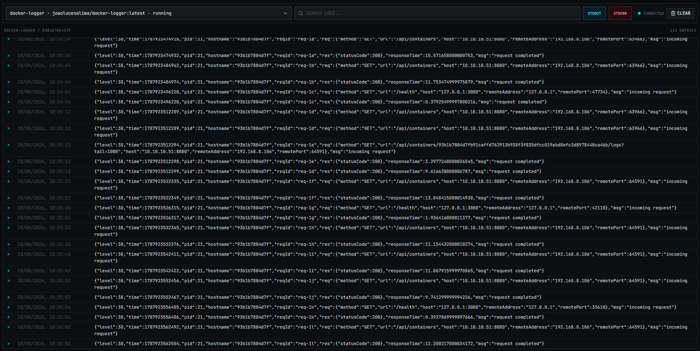

# Docker Logger

Docker Logger is a lightweight web interface for viewing Docker container logs
in real time. It runs as a single container and connects to the Docker Engine
through the host's Unix socket.

<p align="center">
  
</p>

## Features

- Browse and search containers by name, image, or status.
- Load up to 10,000 recent log entries.
- Stream new logs in real time with Server-Sent Events (SSE).
- Filter `stdout` and `stderr` independently.
- Search log contents directly in the browser.
- Render standard, bright, 256-color, and RGB ANSI sequences.
- Pause live updates while browsing older entries and show a new-entry counter.
- Efficiently display large log sets with a virtualized list.
- Use a responsive interface with locally hosted fonts.

## Requirements

To run the published image, you need:

- Docker Engine with Docker Compose support;
- permission to access the Docker socket, normally `/var/run/docker.sock`.

For local development, you also need Bun 1.3 or later.

> Mounting the Docker socket gives the application privileged access to the
> Docker host. Run it only on trusted machines and networks.

## Installation

### Docker image

Pull the latest image from Docker Hub:

```bash
docker pull joaolucenalima/docker-logger:latest
```

### From source

Clone the repository and install the workspace dependencies:

```bash
git clone https://github.com/joaolucenalima/docker-logger.git
cd docker-logger
bun install
```

## Running

### Docker

Start the published image and mount the Docker socket:

```bash
docker run --rm \
  --name docker-logger \
  -p 8080:3000 \
  -v /var/run/docker.sock:/var/run/docker.sock \
  joaolucenalima/docker-logger:latest
```

Open [http://localhost:8080](http://localhost:8080).

### Docker Compose

Build and start the application from the repository:

```bash
docker compose up --build
```

Open [http://localhost:8080](http://localhost:8080). To stop the application:

```bash
docker compose down
```

### Local development

Start the Fastify API and Vite development server together:

```bash
bun run dev
```

Open [http://localhost:3001](http://localhost:3001). You can also start each
application separately:

```bash
bun run dev:server
bun run dev:web
```

The application supports these environment variables:

| Variable          | Default                 | Description                                          |
| ----------------- | ----------------------- | ---------------------------------------------------- |
| `PORT`            | `3000`                  | HTTP port used by the server.                        |
| `CORS_ORIGIN`     | `http://localhost:3001` | Allowed origin during local development.             |
| `DOCKER_SOCKET`   | `/var/run/docker.sock`  | Docker Engine Unix socket path.                      |
| `LOG_BUFFER_SIZE` | `10000`                 | Maximum buffered entries for each shared log stream. |

