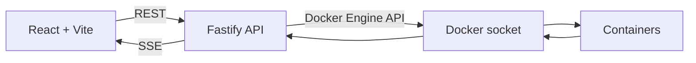

# Docker Logger

Uma interface web leve para acompanhar logs de containers Docker em tempo real. O projeto oferece busca, filtros por stream, interpretação de cores ANSI e uma lista virtualizada preparada para grandes volumes de saída.

O navegador nunca acessa o socket do Docker diretamente. Um backend Fastify consulta a Docker Engine API pelo socket Unix, normaliza os logs e os distribui ao frontend por REST e Server-Sent Events (SSE).

## Recursos

- seleção e busca de containers por nome, imagem ou estado;
- carregamento inicial dos últimos 1.000 logs, configurável até 10.000 por requisição;
- atualizações em tempo real por SSE, com um único stream Docker compartilhado por container;
- separação entre `stdout` e `stderr`, com filtros independentes;
- reconstrução de frames multiplexados e linhas fragmentadas do protocolo Docker;
- preservação e interpretação de sequências ANSI, incluindo cores padrão, bright, 256 cores e RGB;
- versões ANSI (`message`) e normalizada (`plainMessage`) de cada mensagem;
- busca textual executada localmente no navegador;
- virtualização de até 10.000 entradas, com alturas calculadas pelo Pretext;
- modo LIVE, pausa automática ao navegar pelo histórico e contador de novas entradas;
- interface responsiva com JetBrains Mono carregada localmente.

## Arquitetura



Em produção, o Fastify também serve o build estático do frontend. Assim, toda a
aplicação é distribuída em uma única imagem e executada por um único processo
HTTP. O repositório é um monorepo Bun organizado em:

```text
apps/
├── server/   API, cliente Docker, parser e gerenciamento dos streams
└── web/      interface React, filtros, SSE e visualização virtualizada
packages/
├── config/   configurações TypeScript compartilhadas
└── ui/       componentes e estilos reutilizáveis
```

### Fluxo dos logs

1. O backend abre o endpoint de logs da Docker Engine API com timestamps e streams multiplexados.
2. `DockerLogParser` reconstrói frames e linhas que possam chegar fragmentados.
3. Cada entrada mantém a mensagem ANSI original em `message` e uma versão sem controles em `plainMessage`.
4. A API retorna o histórico via REST e transmite novas entradas via SSE.
5. O frontend interpreta o ANSI para exibição e usa o texto normalizado para calcular a altura das linhas sem provocar reflow.

## Tecnologias

- [Bun](https://bun.sh/) para runtime, workspaces, instalação e testes;
- [Fastify](https://fastify.dev/) no backend;
- [React](https://react.dev/) e [Vite](https://vite.dev/) no frontend;
- [TanStack Router](https://tanstack.com/router) e [TanStack Virtual](https://tanstack.com/virtual);
- [Tailwind CSS](https://tailwindcss.com/) e componentes compartilhados em `packages/ui`;
- [Pretext](https://github.com/chenglou/pretext) para medição de texto;
- Docker e Docker Compose para execução em containers.

## Requisitos

- [Bun](https://bun.sh/) 1.3 ou superior;
- Docker Engine em execução;
- acesso de leitura e escrita ao socket da Docker Engine.

O caminho padrão do socket é `/var/run/docker.sock`. Em ambientes que usam outro caminho, configure `DOCKER_SOCKET`.

## Desenvolvimento local

Clone o repositório, instale as dependências e inicie os dois aplicativos:

```bash
git clone <url-do-repositorio>
cd docker-logger
bun install
bun run dev
```

Acesse [http://localhost:3001](http://localhost:3001). O Vite encaminha as requisições `/api` para o backend em `http://localhost:3000`.

Também é possível iniciar os serviços separadamente:

```bash
bun run dev:server
bun run dev:web
```

> No Linux, o usuário que executa o backend precisa ter permissão para acessar o socket Docker. Não altere permissões do socket de forma indiscriminada; prefira a configuração recomendada pela sua distribuição.

## Docker Compose

Para construir a imagem única e conectar a aplicação ao Docker do host:

```bash
docker compose up --build
```

A aplicação ficará disponível em [http://localhost:8080](http://localhost:8080).
O Fastify serve a interface, a API e o stream SSE pela mesma porta.

Para encerrar:

```bash
docker compose down
```

Também é possível usar diretamente a imagem publicada no Docker Hub:

```bash
docker run --rm \
  --name docker-logger \
  -p 8080:3000 \
  -v /var/run/docker.sock:/var/run/docker.sock \
  joaolucenalima/docker-logger:latest
```

Para construir a imagem sem o Compose:

```bash
docker build -t docker-logger .
```

Ao iniciar como `root`, a imagem identifica o grupo do socket montado, concede
esse grupo ao usuário `bun` e executa a aplicação sem privilégios de root.

## Configuração

| Variável | Padrão | Descrição |
| --- | --- | --- |
| `PORT` | `3000` | Porta HTTP do backend. |
| `CORS_ORIGIN` | `http://localhost:3001` | Origem permitida pelo CORS. |
| `DOCKER_SOCKET` | `/var/run/docker.sock` | Caminho do socket da Docker Engine. |
| `LOG_BUFFER_SIZE` | `10000` | Número máximo de entradas mantidas no buffer compartilhado por stream. |

`STATIC_ROOT` aponta para os arquivos compilados do frontend e já vem definido
como `/app/public` na imagem. Normalmente não é necessário alterá-lo.

## API

| Método | Endpoint | Descrição |
| --- | --- | --- |
| `GET` | `/health` | Verificação simples de disponibilidade. |
| `GET` | `/api/containers` | Lista todos os containers e seus estados. |
| `GET` | `/api/containers/:id/logs?tail=1000` | Retorna o histórico do container. `tail` aceita valores entre 1 e 10.000. |
| `GET` | `/api/containers/:id/logs/stream` | Abre o stream SSE de novas entradas. |

Uma entrada de log possui o seguinte formato:

```json
{
  "id": "container-id-1724150000000-1",
  "containerId": "container-id",
  "stream": "stdout",
  "timestamp": "2026-08-20T10:00:00.000Z",
  "message": "\u001b[32mserver ready\u001b[0m",
  "plainMessage": "server ready"
}
```

## Scripts

| Comando | Descrição |
| --- | --- |
| `bun run dev` | Inicia backend e frontend em modo de desenvolvimento. |
| `bun run build` | Gera os builds de produção de todos os workspaces. |
| `bun run check-types` | Executa a verificação TypeScript. |
| `bun run --cwd apps/server test` | Executa os testes do backend. |
| `bun run format` | Formata o repositório com Biome. |
| `bun run check` | Aplica as verificações e correções do Biome. |

Antes de enviar uma alteração, execute:

```bash
bun run check-types
bun run --cwd apps/server test
bun run build
```

## Publicação da imagem

O workflow `.github/workflows/docker-publish.yml` valida a imagem em pull
requests e publica um manifesto para `linux/amd64` e `linux/arm64` em pushes na
branch `main` e em tags como `v1.2.3`.

Configure no repositório GitHub:

- a variável `DOCKERHUB_USERNAME` com o usuário do Docker Hub;
- o secret `DOCKERHUB_TOKEN` com um access token que possa publicar em
  `joaolucenalima/docker-logger`.

A branch `main` atualiza `latest` e uma tag `sha-...`. Uma tag Git `v1.2.3`
publica `1.2.3`, `1.2`, `1` e a tag do commit. Pré-releases não atualizam
`latest`.

## Segurança

Montar `/var/run/docker.sock` concede ao backend acesso privilegiado ao Docker host. Mesmo que os endpoints atuais sejam somente de leitura, trate a aplicação como um serviço administrativo:

- execute-a apenas em redes e máquinas confiáveis;
- não publique o backend diretamente na internet;
- restrinja CORS e acesso ao proxy reverso;
- revise alterações nos endpoints antes de realizar um deploy;
- considere um socket proxy com permissões mínimas em ambientes compartilhados.

## Contribuindo

Issues e pull requests são bem-vindos. Para contribuir:

1. crie um fork e uma branch descritiva;
2. mantenha as mudanças pequenas e focadas;
3. adicione ou atualize testes quando alterar comportamento;
4. execute as verificações locais;
5. descreva no pull request o problema, a solução e como validar o resultado.

Ao reportar um bug, inclua o sistema operacional, versões do Bun e Docker, passos para reprodução e logs relevantes sem dados sensíveis.
